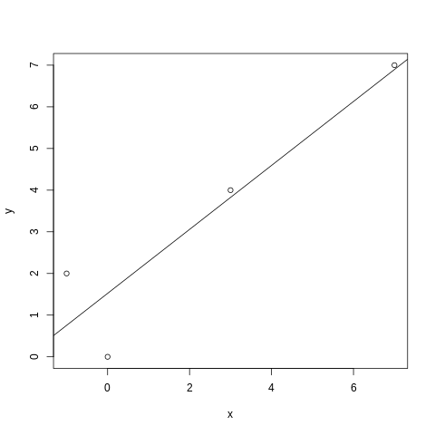

# CP6 Ejercicio 2

El ejercicio pide ajustar los siguientes datos a una recta por mínimos cuadrados:

| $x$   | -3  | -1 | 1   | 3   | 5   | 7
| :---: | --- | ---| --- | --- | --- | ---
| $y$   | 14  | 4  | 2   | 8   | 22  | 44

La recta obtenida es: $y = 3x + 9.6667$

El diagrama de dispersión queda de la siguiente forma:

Para $x = 0$ la recta predice el valor $y = 9.6667$

Para $x = 2$ la recta predice el valor $y = 15.6667$
