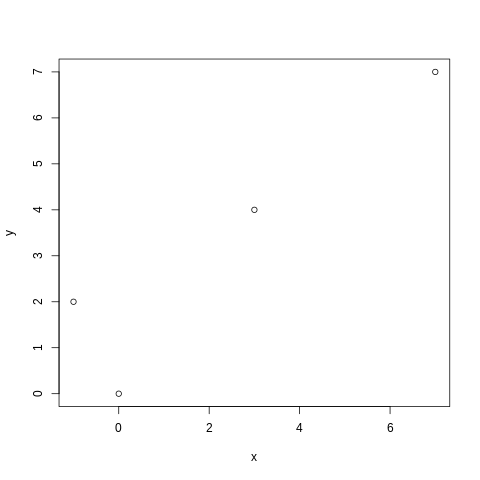

# CP6 Ejercicio 1

El ejercicio pide ajustar los siguientes datos a una recta por mínimos cuadrados:

| $x$   | -1  | 0 | 3 | 7
| :---: | --- |---|---|---
| $y$   | 2   | 0 | 4 | 7

La recta obtenida es: $y = x * 0.7677 + 1.5225$

El diagrama de dispersión queda de la siguiente forma:

Al ver el diagrama y la forma en la que están distribuidos los puntos, notamos que lo mejor para estos datos es usar regresión lineal simple.

Para $x = 1$ la recta predice el valor $y = 2.2903$
