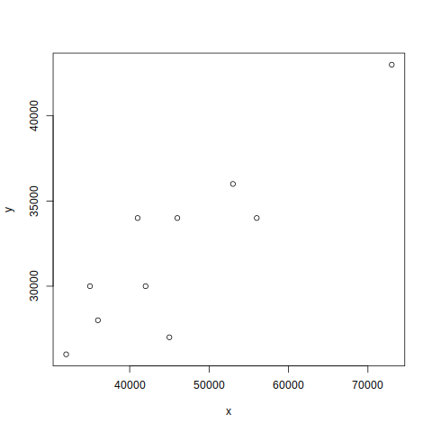
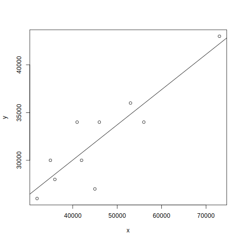

# CP6 Ejercicio 8

En el ejercicio se analizan los siguientes datos :

|  $x$  |  $y$  |
| :---: | :---: |
| 46000 | 34000 |
| 45000 | 27000 |
| 35000 | 30000 |
| 32000 | 26000 |
| 42000 | 30000 |
| 36000 | 28000 |
| 41000 | 34000 |
| 56000 | 34000 |
| 73000 | 43000 |
| 53000 | 36000 |

**a)** Construya el diagrama de dispersión utilizando $x$ = costo de lujo y $y$ = costo semejante. ¿Parece ser lineal la relación? Explique.

La relación parece ser lineal dado que los datos visiblemente cumplen los supuestos; esto es, su varianza se aprecia constante, la dispersión de los datos no es muy grande, y se podría trazar una recta con pendiente positiva a modo de definir un modelo de regresión lineal simple.

**b)** Encuentre la ecuación de la recta de mejor ajuste.

Usando el _Método de Mínimos Cuadrados_, se obtuvo la siguente recta:

$y = x * 0.36966 + 15233$

**c)** Trace la recta en el diagrama de dispersión.

**d)** Interprete la pendiente de la ecuación de regresión.

La pendiente es positiva; lo cual significa que para mayor precio de un modelo de lujo, se pronostica un mayor precio en la alternativa semejante.

**e)** Estime el costo de un vehículo “semejante” comparable a uno de lujo de $60 000. Explique su respuesta.

El costo estimado es de $\$37412$. Para estimar este precio, se usó la recta por mínimos cuadrados. La respuesta puede ser considerada confiable ya que $60000$ esta dentro del dominio muestral de la variable de entrada y cumple con el resto de las restricciones. Si se compara con los precios de modelos de lujo cercanos ($56000$ y $73000$), se aprecia que el precio del modelo semejante no carece de lógica ($34000$ y $43000$ respectivamente). Además, en el inciso d, se explicó un comportamiento que se nota consistente con estos datos; esto es, $73000 > 60000 > 56000$ y $43000 > 37412 > 34000$ para precios de modelos de lujo y semejantes respectivamente.

**f)** Estime el costo de un vehículo “semejante” comparable a uno de lujo de $40 000. Explique su respuesta.

El costo estimado es de $\$30019$. Para estimar este precio, al igual que en el inciso anterior, se usó la recta por mínimos cuadrados. Aplicando un análisis similar al anterior, podemos obtener las mismas conclusiones. La mayor particularidad que se puede detectar para $40000$, es que se encuentra en un rango de mayor dispersión y agrupación de los datos que $60000$; lo cual explica que un prónostico de precios del modelo semejante tienda a disminuir, mientras el precio del modelo de lujo se acerca a $45000$ . Esto se puede apreciar en las gráficas también.