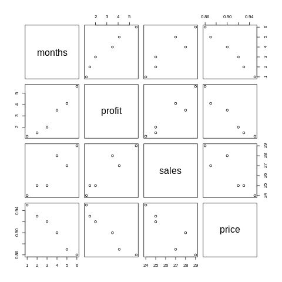
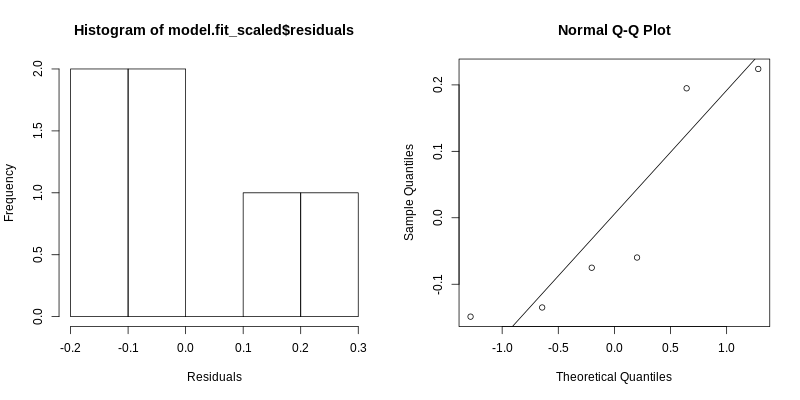
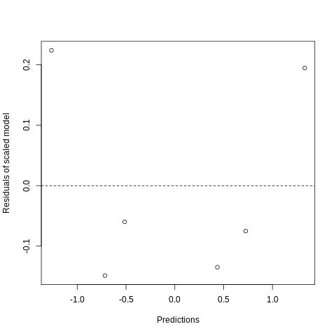

## CP 7 Ejercicio 2
---

En primer lugar hacemos un scatter plot entre todos los pares de variables en el data frame. Podemos apreciar que todos los pares de variables parecen tener una relación lineal.

A continuación se realizó llamada al método *lm* para realizar la regresión múltiple:

Coefficients: | Estimate |Std. Error | t value  | Pr(>\|t\|)
---           |---       | ---       |---       |---
(Intercept)   | 15.9421  |  41.4813  |  0.384   |   0.738
months        | 0.1000   |  0.9549   | 0.105    |  0.926
sales         | 0.3447   |  0.2828   | 1.219    |  0.347
price         | -24.7368 |   44.4184 |  -0.557  |    0.634

Con error residual de 0.4501.

Se observa que el coeficiente de intercepto es muy grande respecto al resto por lo que se decide estandarizar los datos, usando el método *scale*, obteniéndose los siguientes coeficientes:

Coefficients: | Estimate     | Std. Error |    t value | Pr(>\|t\|)
---           |  ---         |   ---      | ---        | ---
(Intercept)   | -6.365e-16   | 1.071e-01  |  0.000     |  1.000
months_scaled | 1.091e-01    | 1.042e+00  | 0.105      | 0.926
sales_scaled  | 3.952e-01    | 3.242e-01  | 1.219      | 0.347
price_scaled  | -5.058e-01   |  9.083e-01 | -0.557     |  0.634

Con error residual de 0.2625.

Ambos modelos comparten los siguientes datos:

    Multiple R-squared  0.9724
    Adjusted R-squared  0.9311 
    F-statistic         23.53 on 3 and 2 DF
    p-value             0.04104

El parámetro *Adjusted R-squared* es 0.93 lo cual es bueno, es cercano a 1. Vemos que el segundo modelo, con las variables estandarizadas, tiene menor error residual 0.26 vs 0.45. El *p-valor* del estadígrafo de F es menor q 0.05 por lo que existe una variable significativamente distinta de 0 en el modelo.

De aquí en adelante vamos a analizar el segundo modelo ya que presentó mejor ajuste a los datos.

### Análisis de residuos
---

1. Media de errores:

        Media de error residual  2.312739e-17
        Suma de error residual   1.387779e-16

    Por lo que se cumple que ambas son muy cercanas a 0.

2. Podemos ver el histograma de residuos y el gráfico QQ-Plot para asegurar que los errores están distribuidos normal:

    

3. Independencia de los residuos:
   
    Al realizar el test de Durbin-Watson obtenemos:

        DW = 1.6629, p-value = 0.3457

    Como el $0.34 >> 0.05$ no podemos rechazar la hipótesis nula por lo que los errores son independientes.
    
4. Homocedasticidad

    Se realiza el gráfico de predicciones contra errores residuales:

    

    Como podemos ver los valores son aleatorios por lo que se cumple la Homocedasticidad.
