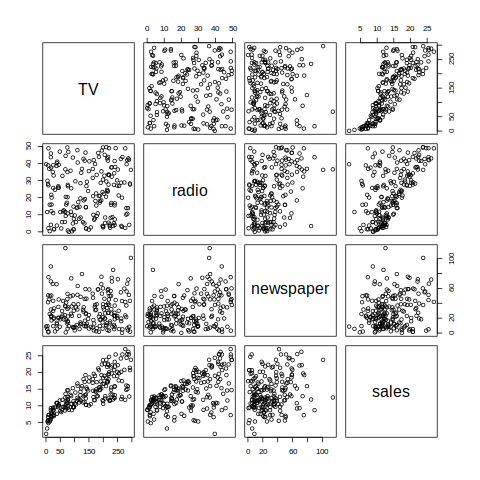
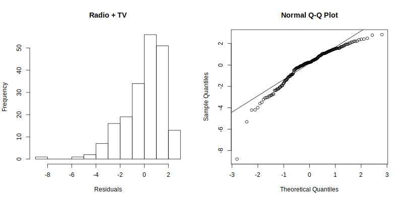
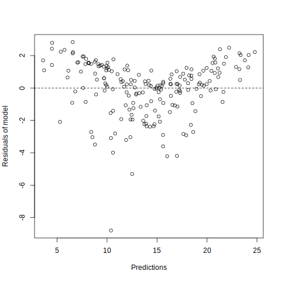

# CP 7 Ejercicio 3

En primer lugar se extraen los datos de Advertising.csv y se hace un scatter plot matrix entre todos los pares de variables del data frame. Es apreciable que los pares de variables independientes no parecen tener una relación lineal fuerte; y entre las variables independientes, y la dependiente, hay una relacion lineal visible para TV con las ventas(sales), y para radio con las mismas.

Esta observación la apoya también la matriz de correlación:

                  TV      radio  newspaper     sales
    TV        1.00000000 0.05480866 0.05664787 0.7822244
    radio     0.05480866 1.00000000 0.35410375 0.5762226
    newspaper 0.05664787 0.35410375 1.00000000 0.2282990
    sales     0.78222442 0.57622257 0.22829903 1.0000000   

Donde se aprecia que entre las variables independientes no hay correlación lineal. También se puede observar que entre las ventas y la TV existe una correlación lineal fuerte, y una débil entre las ventas y la radio.

Se utilizaŕá el método _backward_ para encontrar un modelo de regresión de estos datos.

En primer lugar, se realizó una llamada al método `lm` para realizar la regresión múltiple:

| Coefficients: | Estimate  | Std. Error | t value | Pr(>\|t\|) |
| ------------- | --------- | ---------- | ------- | ---------- |
| (Intercept)   | 2.938889  | 0.311908   | 9.422   | <2e-16     |
| radio         | 0.188530  | 0.008611   | 21.893  | <2e-16     |
| TV            | 0.045765  | 0.001395   | 32.809  | <2e-16     |
| newspaper     | -0.001037 | 0.005871   | -0.177  | 0.86       |

Con error residual de 1.686 y los siguientes _Performance Measures_:

    Multiple R-squared  0.8972
    Adjusted R-squared  0.8956 
    F-statistic         570.3 on 3 and 196 DF
    p-value             < 2.2e-16

El parámetro *Adjusted R-squared* es $0.90$ aproximadamente por lo podemos decir que el modelo es bastante bueno, es cercano a $1$, aunque no es el ideal. Se decidió no estandarizar el modelo ya que la diferencia del coeficiente de intercepto no es muy grande respecto al resto.

Se prosigue entonces a encontrar un modelo mejor que este, eliminando una variable.

En la tabla de coeficientes se puede observar que el Pr(>\|t\|) para _newspaper_ es mayor q $0.05$, con lo cual se puede afirmar que no es significativa, que no está aportando nada al modelo, y por tanto se puede eliminar. Recuerde el lector, que al inicio se menciona la inexistencia de correlacion lineal entre esta variable y la variable dependiente. Por todo lo afirmado se elminó la variable independiente _newspaper_ del modelo.

Con el mismo procedimiento sobre el nuevo modelo, se obtuvieron los siguientes datos:

| Coefficients: | Estimate | Std. Error | t value | Pr(>\|t\|) |
| ------------- | -------- | ---------- | ------- | ---------- |
| (Intercept)   | 2.92110  | 0.29449    | 9.919   | <2e-16     |
| radio         | 0.18799  | 0.00804    | 23.382  | <2e-16     |
| TV            | 0.04575  | 0.00139    | 32.909  | <2e-16     |

Con error residual de 1.681 y los siguientes _Performance Measures_:

    Multiple R-squared  0.8972
    Adjusted R-squared  0.8962 
    F-statistic         859.6 on 2 and 197 DF
    p-value             < 2.2e-16

El parámetro *Adjusted R-squared* es $0.8962 > 0.8956$, lo cual es una pequeña mejoría, pero igual es aproximadamente $0.90$ por lo podemos sacar las mismas conclusiones. El valor del coeficiente de intercepto disminuyó ligeramente, otro buen síntoma.

Se puede ver que el segundo modelo, tiene menor error residual $1.681$ vs $1.686$. El *p-valor* del estadígrafo de F es menor que $0.05$ por lo que existe una variable significativamente distinta de $0$ en el modelo.

Aunque los conocimientos de clase sugirieron solo la elminación de _newspaper_, se intentó aplicar el método para otros modelos con la eliminación de otras variables. Los resultados no fueron positivos ni alentadores, con errores residuales mucho más elevados y valores de los parámetros *Adjusted R-squared* mucho menores.

De aquí en adelante se analiza el segundo modelo ya que presentó mejor ajuste a los datos.

### Análisis de residuos
---

1. Media de errores:

        Media de error residual  5.603157e-18
        Suma de error residual   1.110223e-15

    Por lo que se cumple que ambas son muy cercanas a $0$.

2. El histograma de residuos no sigue exactamente el patrón de una distribución normal, sin embargo el _QQ-plot_ muestra solo una pequeña desviación con respecto a la línea de la normal por tanto se puede asumir la normalidad de los errores.

    

3. Independencia de los residuos:

    Al realizar el test de Durbin-Watson obtenemos:

        DW = 2.0808, p-value = 0.7172

    Como $0.71 >> 0.05$ no se rechaza la hipótesis nula por lo que se puede asumir que los errores son independientes.

4. Homocedasticidad

    Se realiza el gráfico de predicciones contra errores residuales:

    

    Como se puede ver, el supuesto de Homocedasticidad se cumple.
