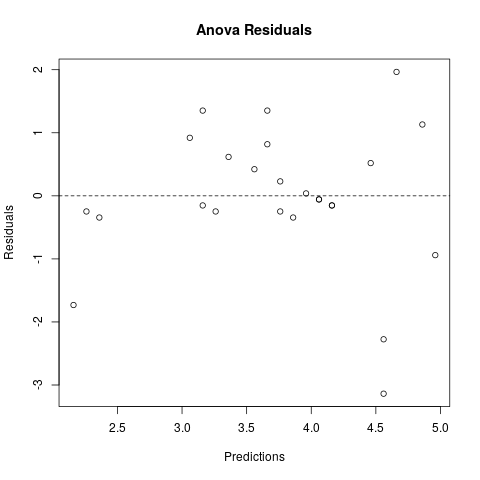
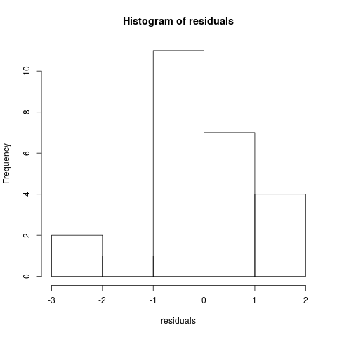
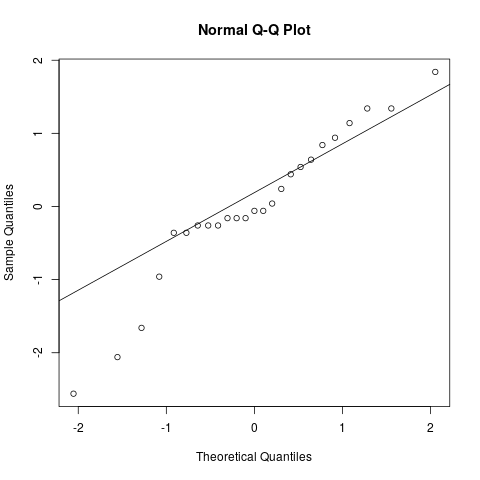

# CP 8 Ejercicio 5

Inicialmente se tomaron los datos mostrados en la tabla del problema, y se acomodaron como se observa a continuación para facilitar su procesamiento.

| $Silo$ | $Día$ | $Mer$ | $Rtd$ | $Diferencia$ |
| :----: | :---: | :---: | :---: | :----------: |
|   A    |  D1   |  4.0  |  2.6  |     1.4      |
|   A    |  D2   |  4.0  |  2.8  |     1.2      |
|   A    |  D3   |  5.0  |  5.0  |     0.0      |
|   A    |  D4   |  0.5  |  0.0  |     0.5      |
|   A    |  D5   |  3.0  |  2.4  |     0.6      |
|   B    |  D1   |  5.0  |  6.4  |     -1.4     |
|   B    |  D2   |  6.0  |  6.4  |     -0.4     |
|   B    |  D3   |  2.0  |  2.4  |     -0.4     |
|   B    |  D4   |  4.0  |  4.2  |     -0.2     |
|   B    |  D5   |  4.0  |  4.0  |     0.0      |
|   C    |  D1   |  4.5  |  3.3  |     1.2      |
|   C    |  D2   |  4.0  |  1.4  |     2.6      |
|   C    |  D3   |  3.5  |  1.8  |     1.7      |
|   C    |  D4   |  2.0  | -1.9  |     3.9      |
|   C    |  D5   |  3.0  | -7.6  |     10.6     |
|   D    |  D1   |  2.5  |  3.1  |     -0.6     |
|   D    |  D2   |  4.0  |  5.0  |     -1.0     |
|   D    |  D3   |  6.5  |  6.6  |     -0.1     |
|   D    |  D4   |  4.5  |  2.7  |     1.8      |
|   D    |  D5   |  4.0  |  6.3  |     -2.3     |
|   E    |  D1   |  4.0  |  0.0  |     4.0      |
|   E    |  D2   |  4.0  |  0.4  |     3.6      |
|   E    |  D3   |  3.5  |  0.6  |     2.9      |
|   E    |  D4   |  2.0  | -4.0  |     6.0      |
|   E    |  D5   |  4.0  | -6.3  |     10.3     |

Una vez agrupados los datos de esta forma se procede ha hacer el análisis **ANOVA** para cada una de las columnas $Mer$, $Rtd$ y $Diferencia$.

## Mer:

Primeramente se realiza el análisis de las medias de factor y las de bloque.

### Paso 1


Como se puede apreciar en los gráficos anteriores aparentemente no se tendrá un efecto dado por el factor silos en las medidas obtenidas usando $Mer$. Sin embargo, en las medias diarias -aunque todos los datos tienen una pequeña intersección como se observa en las cajas- existe una caída en la media del cuarto día; que podría representar la existencia de un efecto dado por los bloques, lo cual será verificado en breve con los resultados del modelo **ANOVA**.

> NOTA: para los análisis posteriores se fijará un nivel de significación $\alpha = 0.05$

### Paso 2

```
            Df Sum Sq Mean Sq F value Pr(>F)
silo        4   4.46   1.115   0.690  0.609
days        4   9.76   2.440   1.511  0.246
Residuals   16  25.84   1.615
```

El análisis de varianza de **ANOVA** para la muestra, tuvo como resultado la imposibilidad de rechazar la Hipótesis nula $H_0$ dado que ambos $p$-$value$ son mayores que la significación $\alpha$ prefijada, por tanto se puede decir que no varía la temperatura promedio de los silos, incluso con el decursar de los días.

Para poder concluir con certeza es necesario realizar una verificación del cumplimientos de los 3 supuestos de este modelo. Para ello se utilizarán los residuos obtenidos en el paso anterior. Los supuestos mencionados son:

1. Los residuos siguen una distribución normal con media cero.
2. Los residuos son independientes entre sí.
3. Los residuos de cada tratamiento tienen la misma varianza $\sigma^2$ .

### Paso 3







Este grupo de gráficos, junto a los test que se harán más adelante, nos ayudaran a conocer si los datos obtenidos mediante **Anova**, son el resultado de un experimento válido.

```
Shapiro-Wilk normality test:
W = 0.94059, p-value = 0.1528

Bartlett test of homogeneity of variances:
Bartlett's K-squared = 9.0433, df = 4, p-value = 0.06003

Durbin-Watson test:
DW = 2.2717, p-value = 0.4632
alternative hypothesis: true autocorrelation is greater than 0
```

En la imágen de los residuos estandarizados, los datos no aparentan tener una varianza constante dada la dispersión presente en ellos; sin embargo de las restantes gráficas se puede decir que los datos son bastante normales. Finalmente, analizando los resultados de las tres pruebas, se puede verificar que el experimento fue válido; dado que ninguna de las pruebas fue significativa, por lo que no se pueden rechazar las hipótesis que afirman el cumplimiento de los supuestos.

Entonces se confirma la conclusión anterior, dado que no hay elementos para negar que no varía la temperatura promedio de los silos, incluso con el decursar de los días.

> Nota: Las siguientes 2 secciones corresponden al análisis a**ANOVA** utilizando otros valores en las mediciónes por tanto se seguirán los mismos pasos mostrados en esta sección.

## Rtd:
