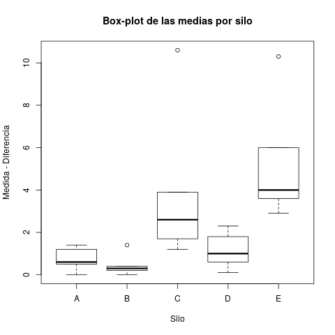

# CP 8 Ejercicio 5

Inicialmente se tomaron los datos mostrados en la tabla del problema, y se acomodaron como se observa a continuación para facilitar su procesamiento.

| $Silo$ | $Día$ | $Mer$ | $Rtd$ | $Diferencia$ |
| :----: | :---: | :---: | :---: | :----------: |
|   A    |  D1   |  4.0  |  2.6  |     1.4      |
|   A    |  D2   |  4.0  |  2.8  |     1.2      |
|   A    |  D3   |  5.0  |  5.0  |     0.0      |
|   A    |  D4   |  0.5  |  0.0  |     0.5      |
|   A    |  D5   |  3.0  |  2.4  |     0.6      |
|   B    |  D1   |  5.0  |  6.4  |     -1.4     |
|   B    |  D2   |  6.0  |  6.4  |     -0.4     |
|   B    |  D3   |  2.0  |  2.4  |     -0.4     |
|   B    |  D4   |  4.0  |  4.2  |     -0.2     |
|   B    |  D5   |  4.0  |  4.0  |     0.0      |
|   C    |  D1   |  4.5  |  3.3  |     1.2      |
|   C    |  D2   |  4.0  |  1.4  |     2.6      |
|   C    |  D3   |  3.5  |  1.8  |     1.7      |
|   C    |  D4   |  2.0  | -1.9  |     3.9      |
|   C    |  D5   |  3.0  | -7.6  |     10.6     |
|   D    |  D1   |  2.5  |  3.1  |     -0.6     |
|   D    |  D2   |  4.0  |  5.0  |     -1.0     |
|   D    |  D3   |  6.5  |  6.6  |     -0.1     |
|   D    |  D4   |  4.5  |  2.7  |     1.8      |
|   D    |  D5   |  4.0  |  6.3  |     -2.3     |
|   E    |  D1   |  4.0  |  0.0  |     4.0      |
|   E    |  D2   |  4.0  |  0.4  |     3.6      |
|   E    |  D3   |  3.5  |  0.6  |     2.9      |
|   E    |  D4   |  2.0  | -4.0  |     6.0      |
|   E    |  D5   |  4.0  | -6.3  |     10.3     |

Una vez agrupados los datos de esta forma se procede ha hacer el análisis **ANOVA** para cada una de las columnas $Mer$, $Rtd$ y $Diferencia$.

## Mer:

Primeramente se realiza el análisis de las medias de factor y las de bloque.

### Paso 1


Como se puede apreciar en los gráficos anteriores aparentemente no se tendrá un efecto dado por el factor silos en las medidas obtenidas usando $Mer$. Sin embargo, en las medias diarias -aunque todos los datos tienen una pequeña intersección como se observa en las cajas- existe una caída en la media del cuarto día; que podría representar la existencia de un efecto dado por los bloques, lo cual será verificado en breve con los resultados del modelo **ANOVA**.

> NOTA: para los análisis posteriores se fijará un nivel de significación $\alpha = 0.05$

### Paso 2

```
            Df Sum Sq Mean Sq F value Pr(>F)
silo        4   4.46   1.115   0.690  0.609
days        4   9.76   2.440   1.511  0.246
Residuals   16  25.84   1.615
```

El análisis de varianza de **ANOVA** para la muestra, tuvo como resultado la imposibilidad de rechazar la Hipótesis nula $H_0$ dado que ambos $p$-$value$ son mayores que la significación $\alpha$ prefijada, por tanto se puede decir que no varía la temperatura promedio de los silos, incluso con el decursar de los días.

Para poder concluir con certeza es necesario realizar una verificación del cumplimientos de los 3 supuestos de este modelo. Para ello se utilizarán los residuos obtenidos en el paso anterior. Los supuestos antes mencionados son:

1. Los residuos siguen una distribución normal con media cero.
2. Los residuos son independientes entre sí.
3. Los residuos de cada tratamiento tienen la misma varianza $\sigma^2$ .

### Paso 3


Este grupo de gráficos, junto a los test que se harán más adelante, nos ayudaran a conocer si los datos obtenidos mediante **Anova**, son el resultado de un experimento válido.

```
Shapiro-Wilk normality test:
W = 0.94059, p-value = 0.1528

Bartlett test of homogeneity of variances:
Bartlett's K-squared = 9.0433, df = 4, p-value = 0.06003

Durbin-Watson test:
DW = 2.2717, p-value = 0.4632
alternative hypothesis: true autocorrelation is greater than 0
```

En la imágen de los residuos estandarizados, la dispersión presente en ellos sugiere que los mismos tienen una varianza constante; sin embargo las restantes gráficas no muestran que los residuos se comporte de manera normal. Finalmente, analizando los resultados de las tres pruebas, se puede verificar que el experimento fue válido; dado que ninguna de las pruebas fue significativa, por lo que no se pueden rechazar las hipótesis que afirman el cumplimiento de los supuestos.

Entonces se confirma la conclusión anterior, dado que no hay elementos para negar que no varía la temperatura promedio de los silos, incluso con el decursar de los días.

> Nota: Las siguientes 2 secciones corresponden al análisis **ANOVA** utilizando otros valores en las mediciónes por tanto se seguirán los mismos pasos mostrados en esta sección.

## Rtd:

### Paso 1


Respecto a las mediciones con $Rtd$ se pueden apreciar variaciones en cuanto al factor silo en de las medias que apuntan a la existencia de un efecto provocado por este factor. Por la otra parte no se puede decir lo mismo con certeza sobre el efecto bloque dado que las medias diarias son bastante similares a excepción de la del 4to día.

### Paso 2

```
            Df Sum Sq Mean Sq F value   Pr(>F)    
df$silo      4 182.53   45.63   8.091 0.000912 ***
df$days      4  62.01   15.50   2.749 0.064865 .  
Residuals   16  90.24    5.64
```

A diferencia de lo ocurrido con $Mer$ al aplicar el análisis **ANOVA** en esta medición vemos como se confirman las sospechas del paso anterior dadas por los datos apreciables en los gráficos de caja. El $p$-$value$ relativo a los silos resulto ser menor que la significación establecida lo cual implica que al menos en uno de los silos la temperatura promedio varía. Claramente es necesario validar esta implicación con los resultados del paso 3 antes de dar una conclusión.

### Paso 3


```
Durbin-Watson test:
DW = 1.5071, p-value = 0.02693
alternative hypothesis: true autocorrelation is greater than 0
```

En este caso de las imágenes muestran datos semejantes a los obenidos con el $Mer$. Los residuos se encuentran dispersos lo cual habla de su varianza constante, el QQ-Plot por el contrario se acerca más a un comportamiento normal pero el histograma tampoco presenta una forma de campana evidene que nos permita creer el cumplimiento del 1er supuesto.

Sucede que al aplicar los test se rechaza que los residuos son independientes dado que el test de **Durbin-Watson** fue significativo por lo cual se rechaza la hipotesis del cumplimiento de este supuesto.

Al fallar los test pierden validez los resultados obtenidos hasta la sección dos dado que en cualquier análisis de varianza queda supeditada dicha validez a que los supuestos del modelo se cumplan. Por tanto no se tienen datos suficientes para hablar del comportamiento de las medidas, de donde no se puede afirmar que se comporten de la misma manera las mediciones en cuanto a los silos y los días.

## Diferencias:

### Paso 1




Análogamente a $Rtd$ vemos en los gráficos de cajas que puede existir un efecto factor en las fluctuaciones de las diferencias entre ambas mediciones, a diferencia de las variaciones diarias que tienen medias semejantes.

### Paso 2

```
            Df Sum Sq Mean Sq F value  Pr(>F)   
df$silo      4  96.81  24.203   6.660 0.00236 **
df$days      4  41.96  10.490   2.887 0.05640 . 
Residuals   16  58.15   3.634
```

Nuevamente el análisis **ANOVA** muestra la existencia de un efecto provocado por los silos en la diferencia de las mediciones, dado que el $p$-$value$ referente a dicho efecto es menor que $\alpha$.

### Paso 3


```
Durbin-Watson test:
DW = 1.4283, p-value = 0.01668
alternative hypothesis: true autocorrelation is greater than 0
```

El análisis de este paso es exactamente igual al de la sección anterior dado q se obtienen los mismos resultados. Del comportamiento de los gráficos se desprenden los mismos resultados -a pesar de que el QQ-Plot mejora- y la prueba de independencia vuleve a fallar dejandonos sin argumentos suficientes para dar una conclusión certera. Por tanto no se puede afirmar la coincidencia de las mediciones.

# Conclusiones

El método aplicado usualmente mediante las mediciones $Mer$ es un método seguro dado que se puede comprobar que sus resultados no se ven modificados por factores externos. Sin embargo al intentar saccar conclusiones relativas al $Rtd$ no se logró siquiera comprobar si se comporta de manera correcta o incorrecta mediante la aplicación del modelo de **ANOVA** a tal punto que incluso el comportamiento de las diferencias entre los resultados quedo indefinido tras la aplicación del mismo análisis. Por tanto la medicónes con $Rtd$ facilitan el proceso pero añaden cierta duda a los datos que se obtienen.