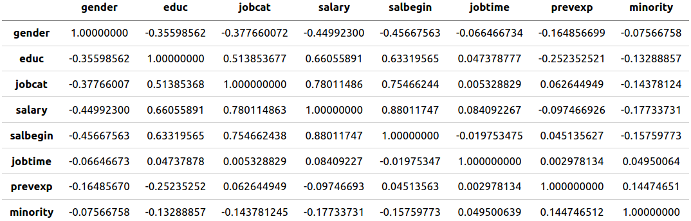
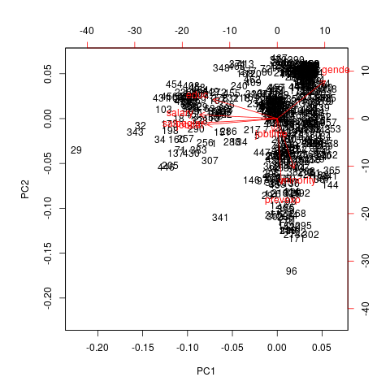

# CP 9 Ejercicio 2

Como es apreciable, se posee en `files/Employee_data.csv`, un set de datos con una cantidad de variables fácil de manejar, se tienen sólo 9 variables. Sin embargo, la cantidad de muestras es extensa, se tienen alrededor de 500 muestras. Al tener tantos datos se hace difícil sacar conclusiones de los mismos, por lo que para hallar cualquier particularidad que estos posean, se pueden aplicar técnicas de clasificación para reducir la dimensión del set en cuestión y facilitar su procesamiento, lo cual es el objetivo fundamental de este trabajo.

Primeramente sería útil ver si existe algun tipo de correlación entre las variables, para ello los datos serán graficados para un análisis visual de su comportamineto.

La gran cantidad de datos dificulta el trabajo con la mayoria de las variables del gráfico anterior, exceptuando quizás al `gender` y alguna otra que posea un rango de valores muy pequeños.

Un segundo acercamiento a la correlación de las variables nos los brinda la matriz de correlación que se verá a continuación.

Esta tabla también es dificir de seguir así que utilizaremos una versión de ella más fácil de analizar mediante la utilización de símbolos.

|              | gender | educ  | jobcat | salary | salbegin | jobtime | prevexp | minority |
| :----------: | :----: | :---: | :----: | :----: | :------: | :-----: | :-----: | :------: |
|  **gender**  |   1    |       |        |        |          |         |         |          |
|   **educ**   |   .    |   1   |        |        |          |         |         |          |
|  **jobcat**  |   .    |   .   |   1    |        |          |         |         |          |
|  **salary**  |   .    |   ,   |   ,    |   1    |          |         |         |          |
| **salbegin** |   .    |   ,   |   ,    |   +    |    1     |         |         |          |
| **jobtime**  |        |       |        |        |          |    1    |         |          |
| **prevexp**  |        |       |        |        |          |         |    1    |          |
| **minority** |        |       |        |        |          |         |         |    1     |

### Leyenda:

|      símbolo      |       |   .   |   ,   |   +   |   *   |   B   |   1   |
| :---------------: | :---: | :---: | :---: | :---: | :---: | :---: | :---: |
| **significación** |   0   |  0.3  |  0.6  |  0.8  |  0.9  | 0.95  |   1   |

Como se muestra, se está en presencia de datos que no son altamente correlacionados. Dado lo anterior las variables son independientes y podemos proceder a realizar el análisis **ACP** para lograr un reducción de la dimensión.

Como resultado se obtiene la importancia de las componentes

|                            |  PC1   |  PC2   |  PC3   |  PC4   |   PC5   |   PC6   |  PC7   |   PC8   |
| :------------------------: | :----: | :----: | :----: | :----: | :-----: | :-----: | :----: | :-----: |
|   **Standard deviation**   | 1.8551 | 1.1378 | 1.0149 | 0.9359 | 0.78722 | 0.62939 | 0.4939 | 0.31350 |
| **Proportion of Variance** | 0.4302 | 0.1618 | 0.1288 | 0.1095 | 0.07746 | 0.04952 | 0.0305 | 0.01228 |
| **Cumulative Proportion**  | 0.4302 | 0.5920 | 0.7208 | 0.8302 | 0.90770 | 0.95722 | 0.9877 | 0.99983 |

Dado los valores principales de las componentes, se observa que las 3 primeras representan a más  del $70\%$ de los datos, por tanto podemos tomarlas como componentes principales, lo cual se puede corraborar con el criterio de **Kaiser** dado que son las únicas columnas con valores propios mayores que uno. Tambien podemos ver este comportamiento gráficamente.

Solo resta sacar resultados de los datos obtenidos; para ello es necesario conocer la matriz de valores propios.

|              |     PC1     |     PC2     |    PC3     |
| :----------: | :---------: | :---------: | :--------: |
|  **gender**  | 0.31361030  | 0.40410654  | 0.0511177  |
|   **educ**   | -0.41756756 | 0.20412799  | -0.1572944 |
|  **jobcat**  | -0.45784273 | -0.06480514 | 0.1184266  |
|  **salary**  | -0.50649386 | 0.04058844  | -0.0378357 |
| **salbegin** | -0.49743796 | -0.04616569 | 0.1097751  |
| **jobtime**  | -0.02879964 | -0.14096756 | -0.8837996 |
| **prevexp**  | 0.02774436  | -0.69718428 | 0.3252938  |
| **minority** | 0.10993740  | -0.53020138 | -0.2412896 |

>NOTA: Solo se muestran las componentes seleccionadas dado que son las que aportan datos a la investigación.

Por cada componente es necesario obtener su mayor valor propio para luego seleccionar las variables de la componente.

- **PC1:** La primera componente presenta un impacto negativo de casi todas las variables involucradas, lo que quiere decir que es una muestra caracterizada por el salario inicial, salario, categoría del trabajo, educación y género.

- **PC2:** Por la segunda componente tomamos el mayor valor propio $0.40$, y lo dividimos entre $2$, esto da $0.20$, todo valor propio cuyo módulo esté por encima de $0.20$ en la columna de la **PC2**, nos dará las variables que conforman esta componente. Por tanto la interpretación sería que la **PC2** está caracterizada por una muestra caracterizada por el género, educación, experiencia previa y minoría.

- **PC3:** El comportamiento de los valores propios de esta componente es similar a la primera. Podemos decir que esta muestra está caracterizada por el tiempo de trabajo, experiencia previa y minoría.

Por último podemos ver el biplot de las dos primeras componentes:

Entre otras informaciones aquí podemos observar una marcada relación entre las variables minoría, experiencia previa y tiempo de trabajo por una parte, y por otra una relación entre educación, salario, salario inicial y categoría del trabajo. Se puede apreciar además, que el género no tiene relación con variables como el salario inicial, categoría del trabajo y experiencia del trabajo.
