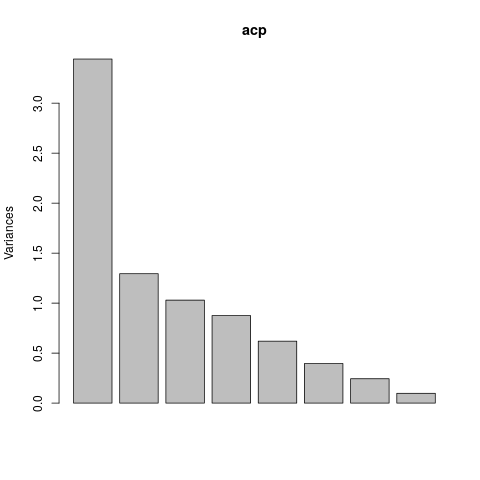

# CP 9 Ejercicio 2

Como es apreciable se posee en `files/Employee_data.csv` un set de datos con una cantidad de variables fácil de manejar, se poseen solo 9 variables. Sin embargo la cantidad de muestras es extensa, se tienen alrededor de 500 muestas. Al tener tantos datos se hace díficil sacar conclusiones de los mismos por lo que para hallar cualquier particularidad que estos posean se puede aplicar técnicas de clasificación para reducir dimensión de el set en cuestión y facilitar su procesamiento, lo cual es el objetivo fundamental de este trabajo.

Primeramente sería útil ver si existe algun tipo de correlación entre las variables, para ello los datos serán graficados para un análisis visual de su comportamineto.

La gran cantidad de datos dificulta el trabajo con la mayoria de las variables del gráfico anterior, exceptuando quizás al `gender` y alguna otra que posea un rango de valores muy pequeños.

Un segundo acercamiento a la correlación de las variables nos los brinda la matriz de correlación que se verá a contuniación.

Esta tabla también es dificir de seguir así que utilizaremos una versión de ella más fácil de analizar mediante la utilización de símbolos.

|              |  id   | gender | educ  | jobcat | salary | salbegin | jobtime | prevexp | minority |
| :----------: | :---: | :----: | :---: | :----: | :----: | :------: | :-----: | :-----: | :------: |
|    **id**    |   1   |        |       |        |        |          |         |         |          |
|  **gender**  |       |   1    |       |        |        |          |         |         |          |
|   **educ**   |       |   .    |   1   |        |        |          |         |         |          |
|  **jobcat**  |       |   .    |   .   |   1    |        |          |         |         |          |
|  **salary**  |       |   .    |   ,   |   ,    |   1    |          |         |         |          |
| **salbegin** |       |   .    |   ,   |   ,    |   +    |    1     |         |         |          |
| **jobtime**  |   B   |        |       |        |        |          |    1    |         |          |
| **prevexp**  |       |        |       |        |        |          |         |    1    |          |
| **minority** |       |        |       |        |        |          |         |         |    1     |

### Leyenda:

|      símbolo      |       |   .   |   ,   |   +   |   *   |   B   |   1   |
| :---------------: | :---: | :---: | :---: | :---: | :---: | :---: | :---: |
| **significación** |   0   |  0.3  |  0.6  |  0.8  |  0.9  | 0.95  |   1   |

Como se muestra, se esta en prescencia de datos que no son altamente correlacionados. Dado lo anterior las variables son independientes y podemos proceder a realizar el análisis **ACP** para lograr un reducción de la dimensión.

Como resultado se obtiene la importancia de las componentes

|                        |  PC1   |  PC2   |  PC3   |   PC4   |   PC5   |   PC6   |   PC7   |   PC8   |   PC9   |
| :--------------------: | :----: | :----: | :----: | :-----: | :-----: | :-----: | :-----: | :-----: | :-----: |
|   Standard deviation   | 1.8571 | 1.4162 | 1.1336 | 0.94856 | 0.78755 | 0.62940 | 0.49395 | 0.31402 | 0.03942 |
| Proportion of Variance | 0.3832 | 0.2229 | 0.1428 | 0.09997 | 0.06892 | 0.04402 | 0.02711 | 0.01096 | 0.00017 |
| Cumulative Proportion  | 0.3832 | 0.6061 | 0.7489 | 0.84883 | 0.91774 | 0.96176 | 0.98887 | 0.99983 | 1.00000 |

Daldo los valores principales de las componentes se observa que las 3 primeras representan a más  del $70\%$ de los datos, por tanto son podemos tomarlas como componentes principales, lo cual se puede corrobor con el criterio de **Kaiser** dado que son las únicas columnas con valores propios mayores que uno. Tambien podemos ver este comportamiento gráficamente.

Solo resta sacar resultados de los datos obtenidos para ello es necesario conocer la matriz de valores propios.

|              |     PC1     |     PC2      |     PC3     |
| :----------: | :---------: | :----------: | :---------: |
|    **id**    | 0.06102325  | 0.698859713  | 0.05286476  |
|  **gender**  | 0.31434167  | 0.039623668  | -0.39588959 |
|   **educ**   | -0.41684721 | 0.020457749  | -0.21550700 |
|  **jobcat**  | -0.45567023 | 0.062701434  | 0.08107702  |
|  **salary**  | -0.50619509 | 0.009233697  | -0.04617078 |
| **salbegin** | -0.49454182 | 0.082196293  | 0.06535886  |
| **jobtime**  | -0.05363936 | -0.700261285 | -0.04937966 |
| **prevexp**  | 0.02739404  | -0.022228979 | 0.72093928  |
| **minority** | 0.10786948  | -0.089294965 | 0.50878746  |

>NOTA: Solo se muetran las componentes seleccionas dado que son las que aportaran datos a la investigación.

Por cada componente es necesario obtener su mayor valor propio para luego seleccionar las variables de la componente.

